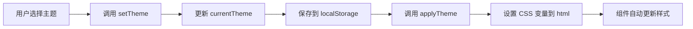

# 主题系统实现原理

## 📋 概述

项目使用 **CSS 变量（CSS Custom Properties）** + **Pinia Store** 实现主题切换系统，支持 5 种预设主题，并可持久化保存用户选择。

## 🔧 实现机制

### 1. 主题预设配置

在 `src/stores/theme.js` 中定义了 5 种主题预设：

```javascript
export const themePresets = {
  light: {
    name: '浅色主题',
    primary: '#1890ff',        // 主色
    primaryHover: '#40a9ff',    // 主色悬停
    background: '#ffffff',     // 背景色
    cardBackground: '#ffffff', // 卡片背景
    textPrimary: '#262626',    // 主要文字
    // ... 更多颜色配置
  },
  dark: { /* 深色主题配置 */ },
  green: { /* 绿色主题配置 */ },
  purple: { /* 紫色主题配置 */ },
  orange: { /* 橙色主题配置 */ },
};
```

### 2. 核心实现：CSS 变量注入

**关键代码：**

```javascript
const applyTheme = (themeName) => {
  const theme = themePresets[themeName] || themePresets.light;
  const root = document.documentElement; // 获取 <html> 元素

  // 遍历主题配置，将每个属性转换为 CSS 变量
  Object.entries(theme).forEach(([key, value]) => {
    if (key !== 'name') {
      // 在根元素上设置 CSS 变量：--theme-primary, --theme-background 等
      root.style.setProperty(`--theme-${key}`, value);
    }
  });

  // 深色主题特殊处理
  if (themeName === 'dark') {
    root.classList.add('dark-theme');
  } else {
    root.classList.remove('dark-theme');
  }
};
```

**工作原理：**

1. 获取当前主题配置对象
2. 在 `<html>` 元素上动态设置 CSS 变量
3. 所有组件通过 `var(--theme-xxx)` 引用这些变量

**示例：**
```javascript
// 当切换到 light 主题时，会在 <html> 上设置：
document.documentElement.style.setProperty('--theme-primary', '#1890ff');
document.documentElement.style.setProperty('--theme-background', '#ffffff');
// ... 等等
```

### 3. 组件中使用主题变量

在 Vue 组件中，通过 CSS 变量使用主题颜色有多种方式：

**方式一：在 `<style>` 中使用 CSS 变量**
```css
.my-button {
  background: var(--theme-primary);
  color: var(--theme-textPrimary);
  border: 1px solid var(--theme-border);
}
```

**方式二：在模板中内联使用**
```vue
<template>
  <div :style="{ background: 'var(--theme-background)' }">
    <p :style="{ color: 'var(--theme-textPrimary)' }">文本</p>
  </div>
</template>
```

**方式三：使用 Tailwind CSS 工具类（推荐）✨**

项目已完美集成 Tailwind CSS，可以直接使用主题相关的工具类：

```vue
<template>
  <!-- 使用 Tailwind 主题类 -->
  <div class="bg-theme-bg text-theme-text p-4">
    <h1 class="text-theme-text">标题</h1>
    <p class="text-theme-text-secondary">副标题</p>
    
    <!-- 按钮 -->
    <button class="bg-theme-primary hover:bg-theme-primary-hover text-white px-4 py-2 rounded-lg shadow-theme">
      按钮
    </button>
    
    <!-- 卡片 -->
    <div class="bg-theme-card border border-theme-border rounded-xl shadow-theme-md p-6">
      卡片内容
    </div>
    
    <!-- 渐变背景 -->
    <div class="bg-theme-gradient text-white p-4 rounded-lg">
      渐变背景
    </div>
  </div>
</template>
```

**可用的 Tailwind 主题类：**

| Tailwind 类 | CSS 变量 | 说明 |
|------------|----------|------|
| `bg-theme-bg` | `--theme-background` | 背景色 |
| `bg-theme-surface` | `--theme-surfaceBackground` | 表面背景 |
| `bg-theme-card` | `--theme-cardBackground` | 卡片背景 |
| `bg-theme-primary` | `--theme-primary` | 主色背景 |
| `text-theme-text` | `--theme-textPrimary` | 主要文字 |
| `text-theme-text-secondary` | `--theme-textSecondary` | 次要文字 |
| `text-theme-text-tertiary` | `--theme-textTertiary` | 三级文字 |
| `border-theme-border` | `--theme-border` | 边框色 |
| `border-theme-border-light` | `--theme-borderLight` | 浅边框 |
| `shadow-theme` | `--theme-shadow` | 阴影 |
| `shadow-theme-md` | `--theme-shadowMedium` | 中等阴影 |
| `shadow-theme-lg` | `--theme-shadowHeavy` | 重阴影 |
| `bg-theme-gradient` | `--theme-gradient` | 渐变背景 |
| `bg-theme-surface-gradient` | `--theme-surfaceGradient` | 表面渐变 |

**完整示例：**
```vue
<template>
  <div class="min-h-screen bg-theme-surface-gradient">
    <!-- 卡片 -->
    <div class="max-w-4xl mx-auto p-6">
      <div class="bg-theme-card border border-theme-border rounded-2xl shadow-theme-lg p-8">
        <h2 class="text-2xl font-bold text-theme-text mb-4">标题</h2>
        <p class="text-theme-text-secondary mb-6">描述文本</p>
        
        <!-- 按钮组 -->
        <div class="flex gap-4">
          <button class="bg-theme-primary hover:bg-theme-primary-hover text-white px-6 py-3 rounded-lg shadow-theme transition-all">
            主要按钮
          </button>
          <button class="bg-theme-secondary text-white px-6 py-3 rounded-lg shadow-theme">
            次要按钮
          </button>
        </div>
      </div>
    </div>
  </div>
</template>
```

### 4. 主题切换流程



**代码流程：**

```javascript
// 1. 用户调用切换主题
themeStore.setTheme('dark');

// 2. setTheme 方法执行
const setTheme = (themeName) => {
  currentTheme.value = themeName;              // 更新状态
  localStorage.setItem('app-theme', themeName); // 持久化
  applyTheme(themeName);                        // 应用主题
};

// 3. applyTheme 设置 CSS 变量
applyTheme('dark');
// → 在 <html> 上设置所有 --theme-* 变量

// 4. 所有使用 var(--theme-*) 的组件自动更新
```

### 5. 持久化存储

```javascript
// 初始化时从 localStorage 读取
const currentTheme = ref(localStorage.getItem('app-theme') || 'light');

// 切换时保存
localStorage.setItem('app-theme', themeName);
```

### 6. 自动监听和初始化

```javascript
// 监听主题变化，自动应用
watch(currentTheme, (newTheme) => {
  applyTheme(newTheme);
});

// 组件加载时立即应用主题
applyTheme(currentTheme.value);
```

## 🎨 使用示例

### 在组件中使用主题

```vue
<template>
  <div class="card">
    <h2 class="title">标题</h2>
    <button class="btn-primary">按钮</button>
  </div>
</template>

<style scoped>
.card {
  background: var(--theme-cardBackground);
  border: 1px solid var(--theme-border);
  box-shadow: 0 4px 12px var(--theme-shadow);
}

.title {
  color: var(--theme-textPrimary);
}

.btn-primary {
  background: var(--theme-gradient);
  color: white;
  box-shadow: 0 4px 12px var(--theme-shadowMedium);
}

.btn-primary:hover {
  background: var(--theme-primaryHover);
}
</style>
```

### 在 JavaScript 中切换主题

```vue
<script setup>
import { useThemeStore } from '@/stores/theme';

const themeStore = useThemeStore();

// 切换主题
const switchTheme = (themeName) => {
  themeStore.setTheme(themeName);
};

// 获取当前主题
const currentTheme = themeStore.currentTheme;

// 获取所有可用主题
const availableThemes = themeStore.getAvailableThemes();
</script>
```

### Tailwind CSS 集成配置

项目已在 `tailwind.config.js` 中配置了主题相关的工具类：

```javascript
// tailwind.config.js
export default {
  theme: {
    extend: {
      colors: {
        'theme-primary': 'var(--theme-primary)',
        'theme-primary-hover': 'var(--theme-primaryHover)',
        'theme-bg': 'var(--theme-background)',
        'theme-surface': 'var(--theme-surfaceBackground)',
        'theme-card': 'var(--theme-cardBackground)',
        'theme-text': 'var(--theme-textPrimary)',
        'theme-text-secondary': 'var(--theme-textSecondary)',
        'theme-border': 'var(--theme-border)',
        // ... 更多主题颜色
      },
      boxShadow: {
        'theme': '0 4px 6px -1px var(--theme-shadow), ...',
        'theme-md': '0 10px 15px -3px var(--theme-shadowMedium), ...',
        'theme-lg': '0 20px 25px -5px var(--theme-shadowHeavy), ...',
      },
      backgroundImage: {
        'theme-gradient': 'var(--theme-gradient)',
        'theme-surface-gradient': 'var(--theme-surfaceGradient)',
      },
    },
  },
};
```

这样配置后，你就可以在 Tailwind 类中直接使用主题颜色，切换主题时所有使用这些类的元素都会自动更新！

## 🔍 技术优势

### ✅ 优点

1. **性能优秀**：CSS 变量由浏览器原生支持，无需重新渲染组件
2. **实时切换**：切换主题时所有组件立即更新，无需刷新页面
3. **易于维护**：集中管理颜色配置，修改一处即可全局生效
4. **类型安全**：通过 TypeScript 可以定义主题类型
5. **持久化**：用户选择自动保存到 localStorage

### 📊 对比其他方案

| 方案 | 性能 | 实时切换 | 维护性 | 兼容性 |
|------|------|----------|--------|--------|
| **CSS 变量** ✅ | ⭐⭐⭐⭐⭐ | ✅ | ⭐⭐⭐⭐⭐ | 现代浏览器 |
| CSS 类切换 | ⭐⭐⭐⭐ | ✅ | ⭐⭐⭐ | 所有浏览器 |
| 动态样式注入 | ⭐⭐⭐ | ✅ | ⭐⭐ | 所有浏览器 |
| 编译时切换 | ⭐⭐⭐⭐⭐ | ❌ | ⭐⭐⭐⭐ | 所有浏览器 |

## 🚀 扩展建议

### 1. 添加新主题

在 `themePresets` 中添加新主题：

```javascript
export const themePresets = {
  // ... 现有主题
  blue: {
    name: '蓝色主题',
    primary: '#1e40af',
    // ... 其他配置
  },
};
```

### 2. 动态主题生成

可以根据用户输入动态生成主题：

```javascript
const createCustomTheme = (primaryColor) => {
  return {
    primary: primaryColor,
    primaryHover: lighten(primaryColor, 10),
    // ... 基于主色生成其他颜色
  };
};
```

### 3. 系统主题跟随

检测系统主题偏好：

```javascript
const prefersDark = window.matchMedia('(prefers-color-scheme: dark)');
if (prefersDark.matches) {
  themeStore.setTheme('dark');
}
```

## 📝 注意事项

1. **CSS 变量命名**：统一使用 `--theme-` 前缀
2. **默认值**：为 CSS 变量提供合理的默认值
3. **浏览器兼容**：CSS 变量不支持 IE11，需要 polyfill
4. **性能优化**：避免在大量元素上频繁切换主题

## 🔗 相关文件

- `src/stores/theme.js` - 主题 Store 定义
- `src/views/Profile.vue` - 使用主题的组件示例
- `src/views/Login.vue` - 使用主题的组件示例
